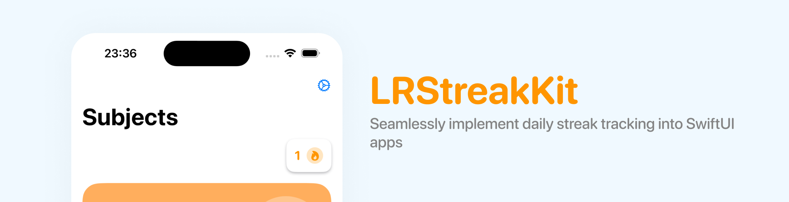

# 🔥 LRStreakKit
<p>


</p>

<p align="center">
    
</p>

### Table of Contents

* [Overview](#overview)
* [Installation](#installation)
* [Requirements](#requirements)
* [Basic Usage](#basic-usage)
* [Customisation](#customisation)
    * [Persistence](#persistence)
        * [Custom Persistence](#custom-persistence)
    * [Appearance](#appearance)
        * [StreakView](#streakview)
        * [Make Your Own](#make-your-own)

## Overview

LRStreakKit is a lightweight Swift library designed to integrate streak tracking in iOS applications written in SwiftUI. This library allows you to implement daily streaks in your app with an easy to use API. It has a built in view component along with customisations and different persistence mechanisms.

[LRStreakKit can be seen in use in Science Makes Sense](https://apps.apple.com/pl/app/science-makes-sense/id1567045742)

## Installation

The library can be be added to your project using [Swift Package Manager](https://www.swift.org/documentation/package-manager/).

Either add the URL to your project by going to File -> Add Package Dependencies and entering:
```
https://github.com/lukerobertsapps/LRStreakKit.git
```

or add it to your `Package.swift`
```swift
dependencies: [
    .package(url: "https://github.com/lukerobertsapps/LRStreakKit.git", .upToNextMajor(from: "1.0.2"))
]
```

## Requirements

- iOS 15 | Xcode 13+

## Basic Usage
To get started, call `setupStreak()` in the entry point of your application. This will inject an instance of `StreakManager` into the SwiftUI environment:
```swift
ContentView()
    .setupStreak()
```

When you want the user to update their streak, access the `StreakManager` from the environment and call `updateStreak()`. This operation may happen when the user first opens the app or when they complete a major action in the app.

```swift
@EnvironmentObject var streak: StreakManager

Button("Check in") {
    streak.updateStreak()
}
```

Finally, display the streak using the built in `StreakView`:
```swift
StreakView()
```

## Customisation

The library can be customised in a few ways to help it fit into your application.

### Persistence

By default, the streak data is stored in UserDefaults under the `"DailyStreak"` key. To change the key, update the `setupStreak()` method:

```swift
ContentView()
    .setupStreak(key: "CustomPersistenceKey")
```

You can also change the technology if UserDefaults isn't your cup of tea:

```swift
ContentView()
    .setupStreak(persistence: .documentsDirectory)
```

Shared UserDefaults is also supported. Just fill in your app group ID

```swift
ContentView()
    .setupStreak(persistence: .sharedUserDefaults(appGroup: "group.example.com"))
```

#### Custom Persistence

If one of the pre-determined persistence options doesn't work for you, you can make your own by conforming to the `StreakPersistence` protocol. Just handle saving and retrieving data:

```swift
class MyCustomPersistence: StreakPersistence {

    func getData() -> Data? {
        //
    }

    func save(data: Data) throws {
        //
    }
}
```
And pass an instance into the setup method:
```swift
ContentView()
    .setupStreak(persistence: .custom(MyCustomPersistence()))
```

### Appearance

You can display the user's streak in a number of ways.

#### StreakView

By default, you can get a great looking view of the streak by using the built in streak view:

```swift
StreakView()
```

You can customise it using a few different options:

```swift
StreakView(
    streakColor: .white,
    noStreakColor: .gray,
    backgroundColor: .black,
    animateOnAppear: true,
    font: .system(size: 16, weight: .bold, design: .rounded),
    imageHeight: 24
)
```

#### Make Your Own

If you want something completely custom, use the `StreakManager` injected into the environment along with a few different properties.

Access the streak manager:
```swift
@EnvironmentObject private var streak: StreakManager
```

Display the current day count:
```swift
streak.getStreakLength()
```

Determine whether the streak has been completed today:
```swift
streak.hasCompletedStreak()
```

A full example:
```swift
struct MyCustomStreakView: View {
    @EnvironmentObject private var streak: StreakManager

    var body: some View {
        VStack {
            Text("\(streak.getStreakLength())")
        }
        .foregroundStyle(streak.hasCompletedStreak() ? .blue : .gray)
    }
}
```
